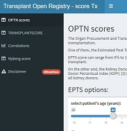
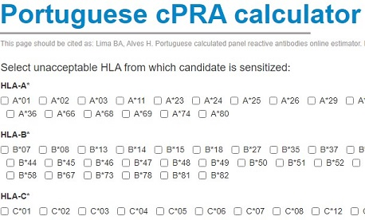
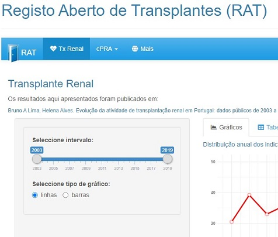
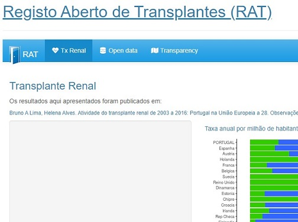

The [Kidney Allocation Rules Simulator (KARS)](https://balima.shinyapps.io/kars/) is an application that allows to simulate different kidney allocation rules in transplantation.

Before implementing new rules, it is necessary to test them in order to dissipate, as much as possible, doubts questioning implementation’s success. The development of this application had as motivation being an aid to clarify the usefulness and efficiency of new set of rules for kidney allocation.

<a href = "https://balima.shinyapps.io/kars/">
``` {r fig.cap = "Kidney Allocation Rules Simulator", echo=FALSE, fig.align = 'left'}

```
</a>

Deceased donors’ kidneys for transplantation are a scarce good, so their use should be made in order to guarantee a good outcome as far as possible. [Score Tx](https://balima.shinyapps.io/scoreTx/) compile risk scores that can predict the outcome inherent to the donor-recipient pair in transplantation allowing better decision making in the allocation of organs and in patients’ clinical management.

<a href = "https://balima.shinyapps.io/scoreTx/">
``` {r fig.cap = "score Tx", echo=FALSE, fig.align = 'right'}

```
</a>

Calculated panel reactive antibodies (CPRA) is a sensitization measure used to classify and prioritize transplant candidates in different kidney transplant allocation systems. CPRA is based on identification of HLA unacceptable on potential organ donors making a transplant candidate ineligible for transplantation. [Portuguese cPRA calculator](https://bioestatisticas.wixsite.com/bioestatisticas/cpra) is an online estimator based on HLA allelic and haplotypic frequencies from Portuguese donors.

<a href = "https://bioestatisticas.wixsite.com/bioestatisticas/cpra">
``` {r fig.cap = "cPRA calculator", echo=FALSE, fig.align = 'left'}

```
</a>

[Renal transplant activity in Portugal](https://bioestatisticas.shinyapps.io/apptxpt/) is a shiny application to report annual renal transplantation activity in Portugal. 

<a href = "https://bioestatisticas.shinyapps.io/apptxpt/">
``` {r fig.cap = "Transplantation activity in Portugal", echo=FALSE, fig.align = 'right'}

```
</a>

[Renal transplantation - Portugal within the EU28](https://bioestatisticas.shinyapps.io/appue28/) is a shiny application to compare Portugal with other countries from EU28 regarding annual renal transplantation activity . 

<a href = "https://bioestatisticas.shinyapps.io/appue28/">
``` {r fig.cap = "Transplantation activity: Portugal within EU", echo=FALSE, fig.align = 'left'}

```
</a>
